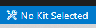
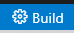
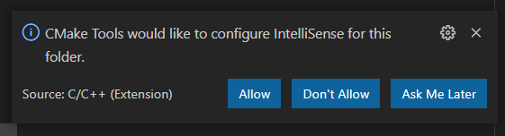
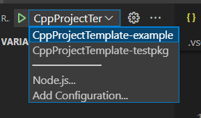

# CppProjectTemplate

C++ CMake project template with Hunter package manager

## Prerequisite

* CMake >= 3.10
* C++ compiler
* IDE related (optional, only for VSCode)
  * VSCode
  * VSCode plugin - C/C++
  * VSCode plugin - CMake
  * VSCode plugin - CMake Tools

## Usage

### Create C++ repo

1. Press the **Use this template** from [CppProjectTemplate](https://github.com/CHChang810716/CppProjectTemplate)
2. Fill repo name & description
3. Press Create repository from template

### Use with VSCode

Here is a flow from CMake configure to Run & Debug the code.

1. Install the VSCode and related plugins(See [Prerequisite](#Prerequisite))
2. Clone your repo to local & open with VSCode
3. CMake: Select a Kit, select your compiler toolchain. 
4. CMake configure build type (optional). 
5. Build. 
6. If CMake asks for the configuration to the IntelliSense, press Don't Allow. (This template generate c_cpp_properties.json for IntelliSense) 
7. Press Run and Debug. 
8. Select executable. 
9. Add breakpoint in source code
10. Press Start debugging.
