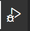

# CppProjectTemplate


C++ CMake project template with [Hunter package manager](https://github.com/cpp-pm/hunter)

## Prerequisite

* CMake >= 3.21.0
* C++ compiler (gcc, msvc, mingw)
* IDE related (optional, only for VSCode)
  * VSCode
  * VSCode plugin - C/C++
  * VSCode plugin - CMake
  * VSCode plugin - CMake Tools

For MinGW users:

Please remember to set the MinGW to the PATH environment.

## Getting Started

This template is based on CMake and aimed to minimize the CMake build script programming effort for the developer.

But we still recommend the users of this template to learn the CMake language.

## Create C++ repo

1. Press the **Use this template** from [CppProjectTemplate](https://github.com/CHChang810716/CppProjectTemplate)
2. Fill repo name & description
3. Press Create repository from template

## Use with VSCode

Here is a flow from CMake configure to Run & Debug the code.

1. Install the VSCode and related plugins(See [Prerequisite](#Prerequisite))
2. Clone your repo to local & open with VSCode
3. CMake: Select a Kit, select your compiler toolchain. 
4. CMake configure build type (optional). 
5. Build. 
6. If CMake asks for the configuration to the IntelliSense, press Don't Allow. (This template generate c_cpp_properties.json for IntelliSense) 
7. Press Run and Debug. 
8. Select executable. 
9. Add breakpoint in source code
10. Press Start debugging.

## Add new executable source code

1. Add new .cpp/.c code under ```src```.
2. reconfigure, done.

See src/CppProjectTemplate/example.cpp for example.

## Add new library source code

1. Add new .cpp/.c code under ```src```.
2. Add cmake file with same name as source, for example: ```src/mycode.cpp```, ```src/mycode.cmake```
3. Edit cmake file, add following content:

```cmake
# src/<your file name>.cmake
include(cmake/scheme/lib.cmake)
```

## Import 3rd party package

1. Open cmake/packages.cmake
2. Add hunter package. For example, add ```fmt``` package:
```cmake
# ...The existing item in packages.cmake
hunter_add_package(fmt)
find_package(fmt CONFIG REQUIRED)
```
3. All the source code can use the imported library directly, no needs to write link script.

* Other examples can be found in ```src/packages.cmake```.
* All available packages can be found [here](https://github.com/CHChang810716/hunter/blob/master/cmake/configs/default.cmake).
* All package import examples can be found [here](https://github.com/CHChang810716/hunter/tree/master/examples).

